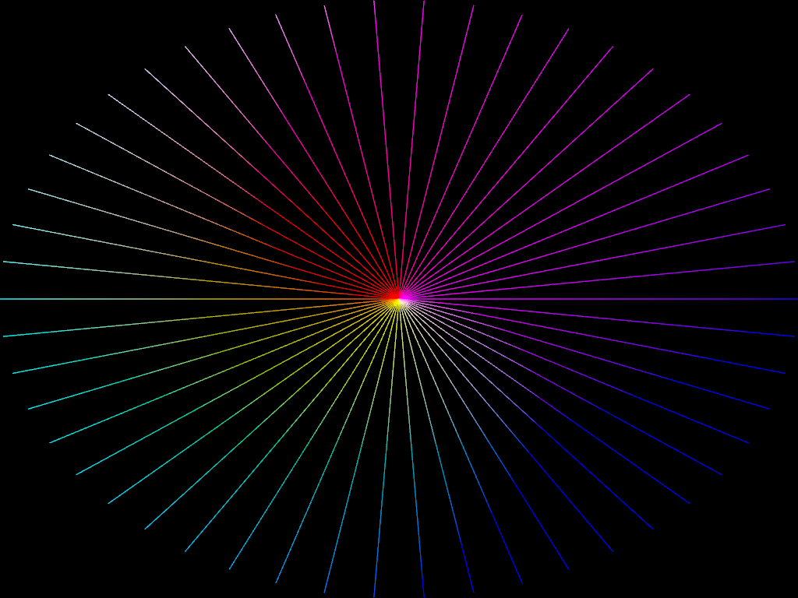

# subpass_msaa

This example shows how to render lines using MSAA through the typed subpass-input pipeline (`subpass_input_multisampled<f32>` + `@builtin(sample_index)`).

Press the left/right arrow keys to toggle between 1x and the adapter's maximum supported sample count.

Modeled on `msaa_line`, but the framebuffer flows through a 2-subpass render graph: subpass 0 rasterizes lines into a transient color attachment, subpass 1 reads that attachment with `subpassLoad` (`subpass_input<f32>` at 1x, `subpass_input_multisampled<f32>` at MSAA). At MSAA, a final fullscreen resolve pass averages samples into the swapchain. This demonstrates the resolved gap #8 path on Metal and Vulkan.

## To Run

```
cargo run --bin wgpu-examples subpass_msaa
```

## Screenshots


